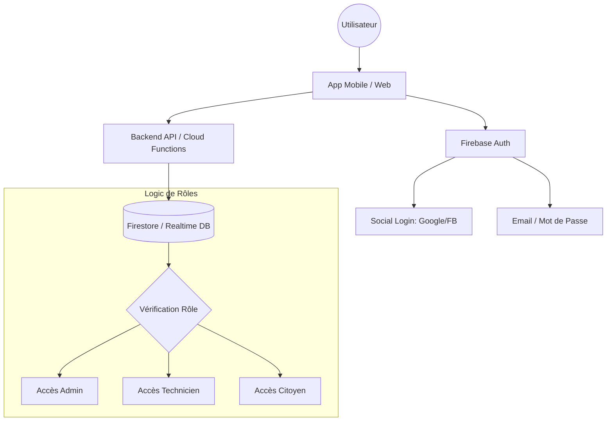

# 🔐 Système d'Authentification "Noor" - Concepteur de Services Citoyens

Ce document détaille l'architecture, les flux et les spécifications techniques du système d'authentification moderne pour l'application **Sansa**.

---

## 🏗️ 1. Architecture Globale

Le système repose sur un modèle hybride utilisant **Firebase Authentication** pour la gestion des identités et une API Backend (ou Cloud Functions) pour la logique métier spécifique (RBAC, invitations techniciens).

### Schéma de l'Architecture

---

## 🔄 2. Flux des Rôles

### A. Flux Citoyen (Self-Service)
1. **Landing** : Choix entre Connexion ou Inscription.
2. **Inscription** : Formulaire Email/Password ou Choix Social (Google/FB).
3. **Validation** : Vérification d'email automatique pour le mode Email.
4. **Session** : Persistance via "Remember Me".

### B. Flux Technicien (Invitation Secure)
1. **Création Admin** : L'Admin crée le profil (Nom, Email, Spécialité) sur son dashboard.
2. **Email Invitation** : Le système crée un compte "invité" et envoie un email avec un **Token JWT éphémère (24h)**.
3. **Initialisation** : Le technicien clique sur le lien, arrive sur une page dédiée pour choisir son mot de passe définitif.
4. **Activation** : Le compte passe d'état *PENDING* à *ACTIVE*.

### C. Flux Admin (Contrôle Total)
1. **Authentification** : Email + Mot de passe fort uniquement.
2. **Gestion** : Dashboard pour inviter, suspendre ou supprimer des comptes techniciens.

---

## 🎨 3. UX Flow (Écran par Écran)

| Écran | Description | Éléments Clés |
| :--- | :--- | :--- |
| **Welcome** | Point d'entrée | Boutons Social Login, Lien "S'inscrire" |
| **Sign Up** | Création citoyenne | Validation temps réel (Ex: "Minimum 8 caractères") |
| **Reset Password**| Récupération | Champ email unique + Animation de confirmation d'envoi |
| **Tech Welcome** | Premier login tech | Champ "Nouveau mot de passe" + "Confirmer" |
| **Dashboard Admin**| Gestion RH | Liste des techniciens, Statut (Actif/Invité), Bouton "Ajouter" |

---

## 🛠️ 4. Recommandations Techniques

### Backend (Node.js/Firebase)
- **Firebase Auth** : Utiliser pour le stockage sécurisé des identités.
- **Custom Claims** : Injecter les rôles (`role: 'admin'`, `role: 'technician'`) dans le token Firebase pour une validation ultra-rapide côté client.
- **Security Rules** : Configurer la base de données pour que seul un Admin puisse écrire dans le répertoire des techniciens.

### Frontend (Android/Compose)
- **State Management** : Utiliser un `UserViewModel` qui expose un `StateFlow<User?>`.
- **Navigation Guard** : Rediriger automatiquement vers l'écran de login si le token expire.
- **Biometry** : Proposer FaceID/Empreinte après le premier login réussi.

---

## 📧 5. Exemples d'Emails (Templates)

### Invitation Technicien
> **Sujet :** Bienvenue dans l'équipe technique Sansa 🛠️
> 
> Bonjour **[Nom]**,
> Votre compte technicien (**Spécialité : [Spécialité]**) a été créé par l'administration.
> Pour activer votre accès et définir votre mot de passe, merci de cliquer sur le lien ci-dessous :
> [Bouton : Définir mon mot de passe]
> *Ce lien expirera dans 24 heures.*

### Réinitialisation de mot de passe
> **Sujet :** Réinitialisation de votre mot de passe 🔒
> 
> Bonjour,
> Nous avons bien reçu votre demande de changement de mot de passe. Cliquez sur le lien pour continuer :
> [Lien Sécurisé]
> Si vous n'êtes pas à l'origine de cette demande, ignorez cet email.

---

## 🔐 6. Sécurité & Best Practices
- **Hashage** : Déjà géré par Firebase (Salted Argon2/Scrypt).
- **Brute Force** : Firebase bloque automatiquement l'adresse IP après 5 échecs consécutifs.
- **Expiration** : Tokens de session rafraîchis toutes les heures.
